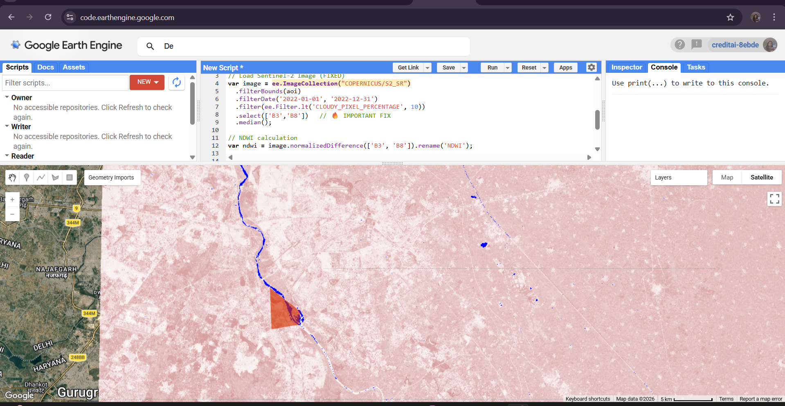
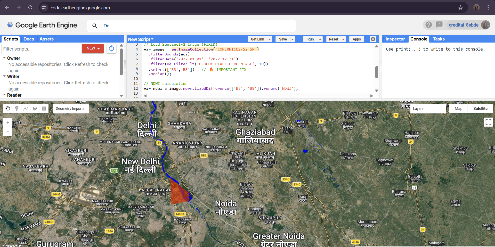
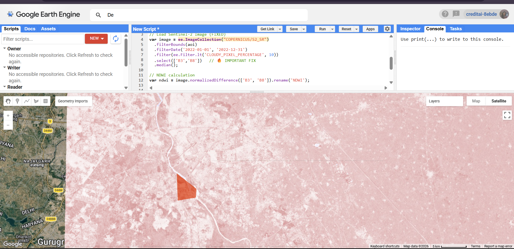

# 🌊 NDWI Water Mapping using Google Earth Engine

## 📌 Overview

This project demonstrates the extraction and visualization of surface water bodies using the **Normalized Difference Water Index (NDWI)** derived from **Sentinel-2 satellite imagery** in **Google Earth Engine (GEE)**.

The goal is to identify water features such as rivers, lakes, and reservoirs within a selected Area of Interest (AOI) using remote sensing techniques.

---

## 🚀 Key Features

* 🌍 Cloud-based geospatial analysis using Google Earth Engine
* 🛰️ Sentinel-2 satellite imagery processing
* 📊 NDWI-based water detection
* 📍 Custom AOI (Area of Interest) selection
* 🎯 Threshold-based water classification
* 🗺️ Visualization in both Map and Satellite modes
* 📸 Export-ready outputs for analysis and reporting

---

## 🧠 Methodology

### 1. Data Source

* Sentinel-2 Surface Reflectance dataset (`COPERNICUS/S2_SR`)

### 2. Preprocessing

* Filter by AOI
* Filter by date range
* Cloud filtering using `CLOUDY_PIXEL_PERCENTAGE`

### 3. NDWI Calculation

NDWI is calculated using the formula:

[
NDWI = \frac{Green - NIR}{Green + NIR}
]

* Green band → **B3**
* NIR band → **B8**

### 4. Water Extraction

* Threshold applied on NDWI values
* Water bodies identified as high NDWI values

---

## 📁 Project Structure

```
NDWI-Water-Mapping/
│── data/
│   ├── raw/                # (Optional) Raw satellite data
│   ├── processed/          # (Optional) Processed raster data
│
│── output/
│   ├── maps/               # Final output images
│   │   ├── ndwi_map.png
│   │   ├── satellite_overlay.png
│   │   ├── water_mask.png
│   ├── shapefiles/         # (Optional) GIS vector outputs
│
│── scripts/
│   ├── ndwi_gee.js         # GEE script
│   ├── ndwi_qgis_steps.txt # QGIS workflow (optional)
│
│── docs/
│   ├── report.md           # Project documentation
│
│── README.md
│── requirements.txt
```

---

## 🖼️ Results

### 🔹 NDWI Map

Shows contrast between land (pink) and water (blue)



---

### 🔹 Satellite Overlay (Best Visualization)

Real-world satellite imagery with detected water bodies



---

### 🔹 Water Mask

Binary classification highlighting only water regions



---

## ⚙️ Technologies Used

* Google Earth Engine (GEE)
* Remote Sensing Techniques
* Sentinel-2 Satellite Data
* JavaScript (GEE API)
* GIS Concepts

---

## 📊 Applications

* Flood monitoring 🌊
* Water resource management 💧
* Environmental analysis 🌱
* Urban planning 🏙️
* Climate studies 🌍

---

## 💡 Key Insights

* NDWI effectively highlights water bodies in urban regions
* Cloud filtering is essential for accurate detection
* Satellite overlay provides better interpretability

---

## 📌 Note

All processing is performed on **Google Earth Engine (cloud platform)**.
Hence, raw satellite datasets are not stored locally in this repository.

---

## 🚀 How to Run

1. Open Google Earth Engine Code Editor
2. Copy code from `scripts/ndwi_gee.js`
3. Define your Area of Interest (AOI)
4. Run the script
5. Visualize NDWI and water layers
6. Export results if needed

---

## 🧑‍💻 Author

**SONAM SHARMA**

* GitHub: https://github.com/sonamsharma0309


---

## ⭐ Acknowledgements

* Google Earth Engine
* Copernicus Sentinel-2 Mission

---

## 📢 Final Note

This project showcases practical implementation of **remote sensing + geospatial analysis**, demonstrating real-world application of satellite data for environmental monitoring.

---
